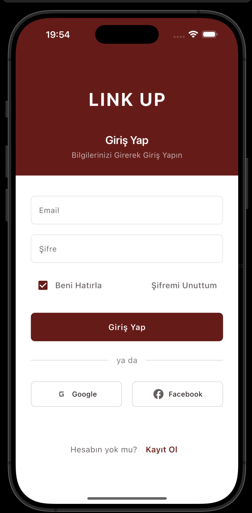
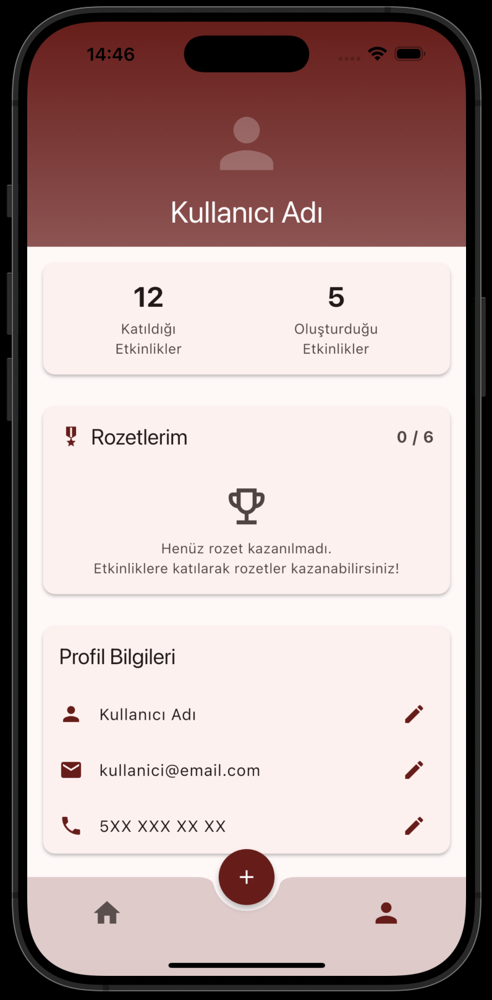
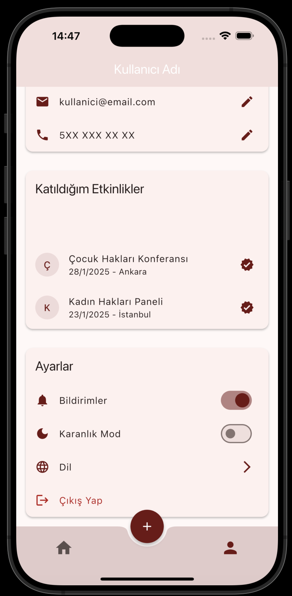
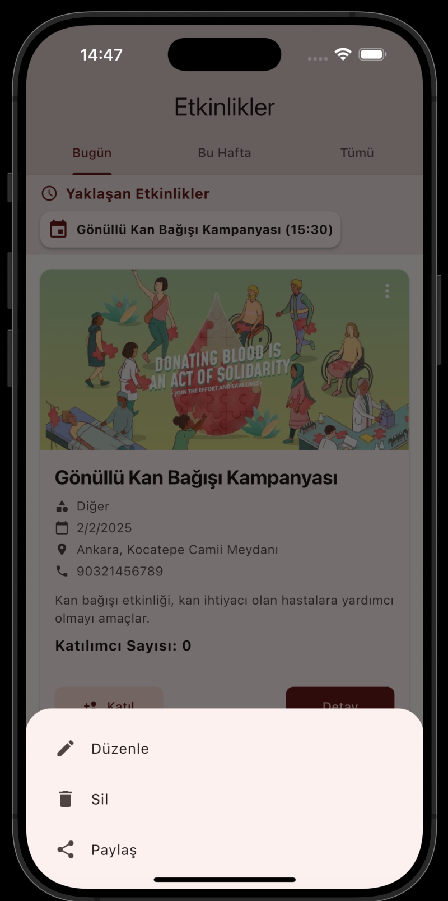
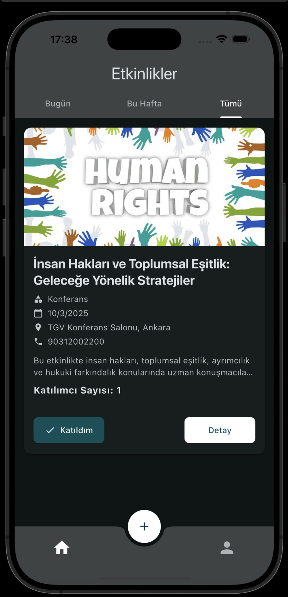
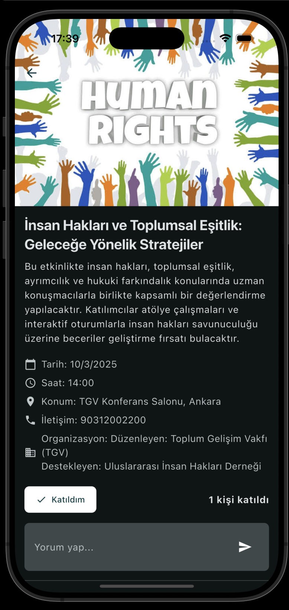

# Linkup  
**Bağlan. Bir Araya Gel. Güçlen.**

<details open>
<summary>🇹🇷 Türkçe</summary>

## 🌍 Proje Hakkında  
Linkup, aktivistleri, gönüllüleri ve insan hakları konusunda duyarlı bireyleri etkinlikler aracılığıyla bir araya getiren bir **mobil uygulama**dır. İster bir konferans, ister protesto, isterse bir bağış kampanyası olsun, Linkup ile bu etkinlikleri keşfetmek, katılmak ve katkıda bulunmak çok kolay!  

---

## 🚀 Özellikler  
- 🎯 **Etkinlik Keşfi**: Etkinlikleri zaman (Bu Hafta, Bu Ay, Gelecek) ve tür (protestolar, konferanslar, eğitimler vb.) bazında listeleyin.  
- 🤖 **Kişiselleştirilmiş Öneriler**: İlgi alanlarınıza ve konumunuza göre öneriler alın.  
- 🏅 **Katılım ve Rozetler**: Etkinliklere katılarak aktivist rozetleri kazanın.  
- 📣 **Etkinlik Paylaşımı**: Kendi etkinliklerinizi oluşturun ve topluluğunuzla paylaşın.  
- 🔔 **Bildirimler**: Etkinlik hatırlatmaları ve güncellemeler alın.  

---

## 📸 Ekran Görselleri  

|                          |                         |
|----------------------------------------|---------------------------------------------|
|    |   |
|    |   |
|    |   |
|    |   |


---

## 🔧 Katkıda Bulunma  
Projeye katkı sağlamak isterseniz:  
1. Depoyu fork edin.  
2. Yeni bir dal oluşturun:  
   ```bash
   git checkout -b ozellik-adi
   ```  
3. Değişiklikleri commit edin:  
   ```bash
   git commit -m "Özellik eklendi"
   ```  
4. Dalı gönderin:  
   ```bash
   git push origin ozellik-adi
   ```  
5. Bir pull request açın.  

---

## ⭐ Katkıda Bulunanlar  
Bu projeye katkıda bulunan geliştiriciler:  
- [Gülnur Türkmen](https://github.com/GulnurTurkmen)  
- [Gülşah Başkurt](https://github.com/Gulsahbb)  

---

## 📄 Lisans  
Bu proje MIT Lisansı ile lisanslanmıştır. Daha fazla bilgi için [LICENSE](LICENSE) dosyasına bakabilirsiniz.  

---

## 📬 İletişim  
Sorularınız veya önerileriniz için bizimle iletişime geçebilirsiniz:  
- **LinkedIn**: -  [ricoglr](https://www.linkedin.com/in/ricoglr)
- **GitHub**: [ricoglr](https://github.com/ricoglr)  

</details>

---

<details>
<summary>🇬🇧 English</summary>

## 🌍 About the Project  
Linkup is a **mobile application** designed to connect activists, volunteers, and individuals passionate about human rights through impactful events. Whether it's a conference, a protest, or a charity campaign, Linkup makes it easy to discover, join, and contribute to these events!  

---

## 🚀 Features  
- 🎯 **Event Discovery**: Browse events categorized by time (This Week, This Month, Upcoming) and type (protests, conferences, workshops, etc.).  
- 🤖 **Personalized Recommendations**: Get suggestions based on your interests and location.  
- 🏅 **Participation & Badges**: Join events and earn activist badges.  
- 📣 **Event Sharing**: Add your own events and share them with the community.  
- 🔔 **Notifications**: Receive event reminders and updates.  

---

## 📸 Screenshots  
|                          |                         |
|----------------------------------------|---------------------------------------------|
|    |   |
|    |   |
|    |   |

---

## 🔧 Contributing  
To contribute to the project:  
1. Fork the repository.  
2. Create a new branch:  
   ```bash
   git checkout -b feature-name
   ```  
3. Commit your changes:  
   ```bash
   git commit -m "Add feature-name"
   ```  
4. Push to the branch:  
   ```bash
   git push origin feature-name
   ```  
5. Open a pull request.  

---

## ⭐ Contributors  
The following developers have contributed to this project:  
- [Gülnur Türkmen](https://github.com/GulnurTurkmen)  
- [Gülşah Başkurt](https://github.com/Gulsahbb)  

---

## 📄 License  
This project is licensed under the MIT License. See the [LICENSE](LICENSE) file for details.  

---

## 📬 Contact  
For questions or suggestions, feel free to reach out:  
- **LinkedIn**: -  [ricoglr](https://www.linkedin.com/in/ricoglr)
- **GitHub**: [ricoglr](https://github.com/ricoglr)  

</details>

